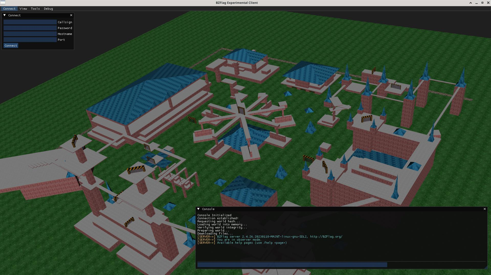

## What is it?

BZ-Next is an experimental fork of BZFlag that redoes the rendering engine from the ground-up, using modern OpenGL, and the Magnum graphics library.

See the [about the project](about) page for more information!

## What does it currently look like?

Map: Rats Nest by Winny

Map: Urban Jungle by Army of One

Map: Fairground

## Where can I get a copy?

BZ-Next is still in heavy development, so releases are expected to be buggy. Windows releases will be made available for download on the [Releases](releases) page. Linux users, please build from source. Instructions are found on the [Building](building) page.

# Development updates: